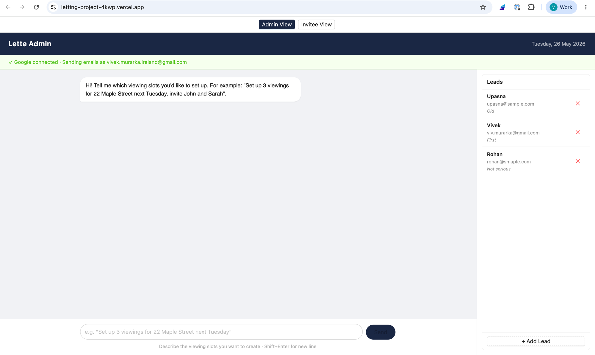

# Lette — AI-Powered Viewing Slot Manager

## Live Demo
- **Frontend**: https://letting-project-4kwp.vercel.app
- **Backend API**: https://letting-project-production.up.railway.app



## What Is This?

A full-stack AI-native property viewing slot manager built as a take-home challenge for Lette. Instead of filling out forms, property managers describe what they need in natural language and the system interprets, confirms, and creates viewing slots — then automatically drafts personalised invitation emails for each lead.

AI is not a sidebar feature here. It is the primary interface and decision-making layer.

## Tech Stack

| Layer | Choice | Reason |
|---|---|---|
| Frontend | React + Vite + TypeScript | Fast setup, familiar, excellent DX |
| UI Library | Ant Design | Rich component library, chat-friendly layout |
| Backend | Express + TypeScript | Matches Lette's stack, simple and explicit |
| Database | Firebase Firestore | NoSQL, zero setup, real-time capable |
| AI | Vercel AI SDK + Gemini 2.0 Flash | Provider-agnostic, structured output, free tier |
| Email | Gmail API via Google OAuth | Sends from admin's own Gmail, no third-party service |
| Calendar | Google Calendar API via OAuth | Adds slots to admin's real calendar |
| Validation | Zod | Runtime schema validation, pairs perfectly with AI SDK |
| Hosting | Vercel (frontend) + Railway (backend) | Zero-config deploys, free tiers |

## Architecture

```
┌─────────────────────────────────────────┐
│         Admin Chat UI (React)           │
│   "Set up 3 viewings next Tuesday..."   │
└────────────────┬────────────────────────┘
                 │ POST /api/slots/parse
                 ▼
┌─────────────────────────────────────────┐
│     Vercel AI SDK + Gemini 2.0 Flash    │
│  generateObject() → Zod schema → JSON   │
│  ambiguous? → clarifying question       │
└────────────────┬────────────────────────┘
                 │ admin confirms
                 │ POST /api/slots/confirm
                 ▼
┌─────────────────────────────────────────┐
│            For each slot:               │
│  • Save to Firestore                    │
│  • Add to Google Calendar               │
│                                         │
│            For each lead:               │
│  • Draft invitation (LLM)               │
│  • Judge draft (LLM) → retry if failed  │
│  • Save to Firestore                    │
│  • Send via Gmail API                   │
└────────────────┬────────────────────────┘
                 │ lead clicks email link
                 ▼
┌─────────────────────────────────────────┐
│      /invite/:id  (Invitee Page)        │
│      POST /api/invitations/:id/accept   │
│      capacity check → accept            │
│                     → alternative slots │
└─────────────────────────────────────────┘
```

## Provider-Agnostic LLM Layer

The entire AI layer uses the Vercel AI SDK with an OpenAI-compatible interface. Switching providers requires changing ONE environment variable:

```bash
LLM_PROVIDER=gemini    # uses Gemini 2.0 Flash (default, free)
LLM_PROVIDER=anthropic # uses Claude Haiku
```

This works because both Google and Anthropic expose OpenAI-compatible REST endpoints. The Vercel AI SDK abstracts over them with a unified `generateObject()` call that guarantees structured JSON output validated against a Zod schema — no fragile string parsing, no hallucinated formats.

## LLM-as-Judge: AI Checking Its Own Work

Every invitation message goes through a two-step quality pipeline:

```
┌─────────────────────────────────────────────────────────┐
│  LLM call 1 — Draft                                     │
│  Write a warm, personalised invitation email            │
└────────────────────────┬────────────────────────────────┘
                         │
                         ▼
┌─────────────────────────────────────────────────────────┐
│  LLM call 2 — Judge                                     │
│  Check: correct address, date, time, lead name,         │
│         no unfilled placeholders, no invented details   │
└──────┬──────────────────────────────────────┬───────────┘
       │ PASS                                 │ FAIL
       ▼                                      ▼
  Save & send              ┌─────────────────────────────────────────┐
                           │  LLM call 3 — Retry                     │
                           │  Redraft with judge's feedback injected  │
                           └──────┬──────────────────────┬───────────┘
                                  │ PASS                 │ FAIL
                                  ▼                      ▼
                             Save & send    ┌────────────────────────────┐
                                           │  LLM call 4 — Humanise     │
                                           │  Convert technical reason   │
                                           │  to friendly admin message  │
                                           └────────────────────────────┘
```

If the judge passes, the message is saved. If it fails twice, the admin sees a friendly message asking them to clarify — never a raw error.

The judge prompt explicitly lists all allowed context (address, date, time, duration, lead notes) so it does not flag legitimate personalisation as "invented details."

## Gemini Free Tier Trade-offs

Gemini 2.0 Flash has a 15 RPM (requests per minute) limit on the free tier. The confirm endpoint makes multiple LLM calls per lead (draft + judge = 2 calls minimum).

**Trade-off made:** invitation drafting is sequential (one lead at a time) with a 2-second delay between leads, rather than parallel. This keeps everything within the free tier at the cost of slightly slower confirmation for large lead lists.

In production this would be replaced with a job queue (BullMQ or similar) with proper rate limiting and retry logic.

## Google Integration

The admin connects their Google account via OAuth once. This gives the app:
- **Gmail API**: invitations are sent from the admin's own email address
- **Google Calendar API**: each viewing slot is added to the admin's primary calendar automatically

Tokens are stored in Firestore (`admin/tokens` document). No third-party email service required.

## Testing

20 unit tests covering:
- Capacity enforcement (accept/reject/alternative slots)
- LLM response schema validation (date format, time format, required fields)
- Edge cases (zero maxAttendees, missing fields, invalid email)

All LLM and Firebase calls are mocked — tests run without any API key.

```bash
cd backend && npm test
```

## Deployment

- **Backend**: Railway with Nixpacks auto-detection, Node 22, env vars in Railway dashboard
- **Frontend**: Vercel with SPA routing config (`vercel.json`), env vars in Vercel dashboard
- **Database**: Firebase Firestore in test mode

Key deployment lessons learned (see backend README for full details):
- Firebase service account must be stored as a single JSON env var, not split fields
- `uuid` must be pinned to v8 for CommonJS compatibility
- `NIXPACKS_NODE_VERSION` must be set as a Railway variable to override the default Node version
- `vercel.json` rewrite rule required for client-side routing

## What I'd Improve With More Time

- Real authentication (JWT for admin, signed invitation tokens for leads)
- Calendar conflict detection before creating slots
- BullMQ job queue replacing sequential LLM calls
- Streaming invitation drafts to the UI in real time
- Admin dashboard showing all slots and who accepted
- Invitation expiry logic
